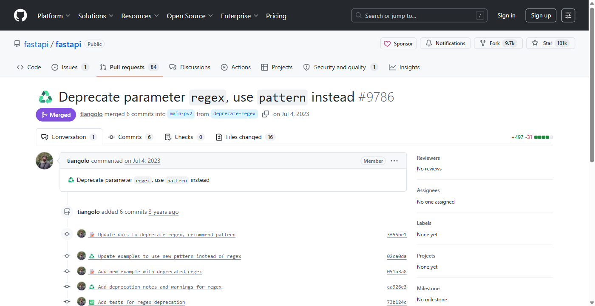
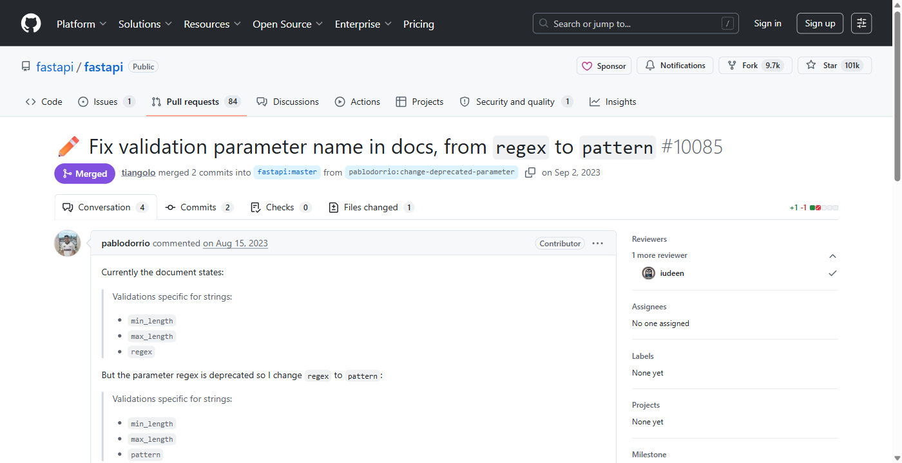

<div align="center">

# 📘 DocGuard — Self-Healing Technical Documentation

**Docs rot silently. DocGuard catches it in the pull request that caused it — and fixes it.**

[](https://www.python.org/)
[](#testing)
[](#)
[](#)
[](#configuration)
[](LICENSE)

[Quickstart](#1-minute-quickstart-github-action) · [Self-host](#self-host-docker) ·
[Configuration](#configuration) · [Architecture](#architecture) ·
[Live dashboard](https://dashboard-sigma-two-78.vercel.app)

</div>

---

## The gap DocGuard closes

In **FastAPI**, the validation parameter `regex` was deprecated in favour of `pattern`:

> **PR #9786 — "Deprecate parameter `regex`, use `pattern` instead"** *(Jul 2023)*



The code changed. The docs kept saying `regex`. They stayed stale until a *different* contributor
noticed and manually opened a **separate** PR — **~2 months later**:

> **PR #10085 — "Fix validation parameter name in docs, from `regex` to `pattern`"** *(Sep 2023)*



**That two-month gap is the problem.** DocGuard would have flagged the stale `regex` mention the
moment #9786 landed, generated the `regex` → `pattern` correction, validated it, and attached it to
the same PR — **changing only the stale sentence and nothing else.**

---

## 1-minute quickstart (GitHub Action)

Drop this into your repo at **`.github/workflows/docguard.yml`** and open a pull request. That's it —
**no API key, no signup, no server.** ([full annotated version](examples/docguard.yml))

```yaml
name: DocGuard

on:
  pull_request:
    paths: ["src/**", "docs/**"]

permissions:
  contents: write        # create the docguard/fix-* branch (auto-fix only)
  pull-requests: write   # post / update the review comment

jobs:
  docguard:
    runs-on: ubuntu-latest
    steps:
      - uses: actions/checkout@v4
        with:
          fetch-depth: 0        # required — DocGuard diffs against the PR base

      - uses: NeetigyaShah/docguard@v1
        with:
          src-paths: src
          docs-paths: docs
          auto-fix: "false"     # "true" → open a docs-fix PR for high-confidence fixes
```

The action authenticates with the workflow's built-in `${{ github.token }}` automatically — you do
not need to create or store a secret. It posts (and updates, never duplicates) a summary comment:

> **📘 DocGuard Results** — Sections verified accurate: X · stale: Y · auto-fixes: Z · requiring human review: N

**Offline by default.** `llm-provider` defaults to `mock`: a deterministic, rule-based oracle that
runs entirely inside the action with **zero network calls and zero cost**. It is high-precision on
structural changes (parameter renames, changed defaults, removals). To catch *semantic* staleness in
prose, switch to a real model:

```yaml
        with:
          llm-provider: openai        # or: anthropic
        env:
          OPENAI_API_KEY: ${{ secrets.OPENAI_API_KEY }}
```

### Action inputs

| Input | Default | Purpose |
|---|---|---|
| `llm-provider` | `mock` | `mock` \| `openai` \| `anthropic` |
| `embedding-provider` | `mock` | `mock` \| `openai` |
| `confidence-threshold` | `0.85` | confidence at or above which a fix may be applied automatically |
| `auto-fix` | `false` | `true` → open a docs-fix PR; `false` → comment only |
| `docs-paths` | `docs` | comma-separated documentation roots |
| `src-paths` | `src` | comma-separated source roots |
| `base` | *(PR base)* | override the git ref to diff against |
| `github-token` | `${{ github.token }}` | token used to comment / open the PR |

Loop prevention: DocGuard skips its own `docguard/*` branches and any commit tagged
`[docguard skip]`. **It never auto-merges**, and never auto-deletes prose — removals always route to
human review.

---

## Self-host (Docker)

DocGuard is a **CLI that analyses one diff per invocation**. There is no webhook listener and no
long-running service — you run it from CI, a cron job, or by hand, and it talks to the GitHub API
only to post the result.

```bash
git clone https://github.com/NeetigyaShah/docguard.git && cd docguard
docker build -t docguard .
```

**Report only** (no credentials, prints JSON, touches nothing):

```bash
docker run --rm -v "$PWD:/repo" -e GITHUB_WORKSPACE=/repo \
  -e INPUT_BASE=origin/main \
  docguard
```

**Comment on / open a PR against a real repository:**

```bash
docker run --rm -v "$PWD:/repo" \
  -e GITHUB_WORKSPACE=/repo \
  -e GITHUB_REPOSITORY=owner/repo \
  -e GITHUB_TOKEN="$GITHUB_PAT" \
  -e INPUT_BASE=origin/main \
  -e INPUT_AUTO_FIX=true \
  -e INPUT_SRC_PATHS=src -e INPUT_DOCS_PATHS=docs \
  docguard
```

| Env var | Required | Purpose |
|---|---|---|
| `GITHUB_WORKSPACE` | yes | path to the mounted repo checkout **inside** the container |
| `INPUT_BASE` | recommended | git ref to diff against (e.g. `origin/main`, `HEAD~1`) |
| `GITHUB_REPOSITORY` | for PR/comment | `owner/repo` slug |
| `GITHUB_TOKEN` | for PR/comment | PAT with `repo` scope (or `contents`+`pull_requests` on a fine-grained token) |
| `GITHUB_EVENT_PATH` | to comment on a PR | path to a GitHub event JSON containing `pull_request.number` |
| `OPENAI_API_KEY` / `ANTHROPIC_API_KEY` | only for real LLM | see [Configuration](#configuration) |

Without `GITHUB_TOKEN` + `GITHUB_REPOSITORY` the run is a **safe dry-run**: it prints exactly what it
*would* have done and exits 0. DocGuard never fails your build just because docs are stale.

Mount the repo with full history (`fetch-depth: 0` / a non-shallow clone) — the diff needs it.

You can also skip Docker entirely:

```bash
pip install -e ".[github]"
docguard analyze --repo . --base origin/main    # JSON report
docguard demo                                   # offline end-to-end demo + metrics
```

---

## Configuration

All configuration is environment variables (or a `.env` file — see [`.env.example`](.env.example)).
**Everything defaults to offline mocks; no keys needed.** Action inputs are simply mapped onto these.

| Variable | Default | Purpose |
|---|---|---|
| `DOCGUARD_LLM_PROVIDER` | `mock` | `mock` \| `openai` \| `anthropic` |
| `DOCGUARD_EMBEDDING_PROVIDER` | `mock` | `mock` \| `openai` |
| `DOCGUARD_OPENAI_MODEL` | `gpt-4o-mini` | model used when provider is `openai` |
| `DOCGUARD_ANTHROPIC_MODEL` | `claude-sonnet-5` | model used when provider is `anthropic` |
| `DOCGUARD_OPENAI_BASE_URL` | — | OpenAI-compatible endpoint (NVIDIA / Together / local vLLM) |
| `DOCGUARD_OPENAI_EMBED_MODEL` | `text-embedding-3-small` | embedding model |
| `DOCGUARD_VECTOR_BACKEND` | `local` | `local` (file-backed) \| `chroma` |
| `DOCGUARD_SIMILARITY_THRESHOLD` | `0.35` | code→doc mapping cut-off |
| `DOCGUARD_HIGH_CONFIDENCE` | `0.85` | at/above → auto-fix eligible |
| `DOCGUARD_MEDIUM_CONFIDENCE` | `0.5` | at/above → human review; below → report only |
| `DOCGUARD_AUTO_FIX` | `false` | allow opening a docs-fix PR |
| `DOCGUARD_SRC_PATHS` / `DOCGUARD_DOCS_PATHS` | `src` / `docs` | comma-separated roots |
| `OPENAI_API_KEY` / `ANTHROPIC_API_KEY` / `GITHUB_TOKEN` | — | read **without** the `DOCGUARD_` prefix |

**Provider selection is lazy**: the `openai` / `anthropic` SDKs are only imported when you actually
select that provider, so the offline path needs no optional dependency installed.

---

## Architecture

An 8-stage pipeline. Each stage is a separate module behind a typed interface:

```
Code change (git diff)
  1 → semantic code units (Python AST · TS/JS/Java tree-sitter)   what actually changed
  2 → meaningful-change classification                            ignore whitespace/comments/refactors
  3 → code→doc mapping (exact + lexical + embedding)              which sections document it
  4 → LLM staleness verification (structured verdict)             is the doc actually wrong?
  5 → targeted repair (only the stale spans)                      surgical edit, rest byte-identical
  6 → second-pass validation                                      independently confirm the fix
  7 → confidence policy → auto-fix | human review | report
  8 → GitHub PR (high confidence) or PR comment (low)
```

**Cost control:** unrelated sections are filtered out *before* any LLM call, only meaningful changes
are verified, and every embedding is cached by content hash. Repository content is always delimited
as **untrusted data** in prompts (prompt-injection safe).

**Key properties**

- **Multi-language** — Python via stdlib `ast`; TS/JS/Java via tree-sitter (prebuilt wheels, no
  compiler). A new language is a sibling parser plus one dispatch row.
- **Meaningful-change classifier** — two versions with the same AST are proven equivalent and never
  reach the LLM.
- **Mapping precision** — a *"documents vs merely mentions"* guard so tutorials aren't falsely linked.
- **Surgical repair** — span-local edits; unaffected text stays byte-identical, then an independent
  validator confirms the edit is scoped, style-preserving, and actually removed the stale claim.
- **Provider abstraction** — deterministic mock or OpenAI / Anthropic / any OpenAI-compatible
  endpoint behind one interface.

Module breakdown: [`docs/ARCHITECTURE.md`](docs/ARCHITECTURE.md) ·
trade-offs: [`docs/DECISIONS.md`](docs/DECISIONS.md).

---

## Dashboard

**[▶ Live demo](https://dashboard-sigma-two-78.vercel.app)** — a React + Vite viewer over the
persistent `.orchestrator/` build/run state. It is a viewer, not the source of truth.

```bash
cd dashboard && npm install && npm run dev
```


---

## Testing

```bash
python -m pytest                       # full suite (110 tests, fully offline)
python scripts/run_milestone.py 3      # milestone evidence for a phase
```

Three levels: feature tests, predefined milestone scenarios from the spec, and added
positive/negative/edge/security cases per phase. Every milestone scenario is recorded to
`.orchestrator/tests.json` with `input / expected / actual / PASS|FAIL`.

---

## Measured metrics

From the deterministic demo's **7 labelled fixtures** (`docguard demo`), using the mock oracle:

| TP | FP | FN | TN | Precision | Recall | F1 |
|----|----|----|----|-----------|--------|----|
| 3 | 0 | 0 | 4 | 1.00 | 1.00 | 1.00 |

These are **computed from executed fixtures, not asserted** — and they measure the pipeline on a
*controlled* set (rename / default / removal vs whitespace / comment / refactor / unrelated).
**They are not a claim about arbitrary real repos.**

### Real-world evaluation (honest)

Run against real clones of **Pydantic** and **FastAPI** via `scripts/eval_realrepo.py`:

- **No false positives.** Negative controls (comment-only edits) were flagged stale **0 times** by
  both providers on both repos. It won't spam bad PRs.
- **Hand-verified real case** — Pydantic `Field(frozen=…)`, parameter renamed `frozen → is_frozen`:
  **mock** flags stale (0.92) *and* emits a correct surgical fix; the **real LLM** flags stale (1.0)
  with correct reasoning but its *repair* step returned no change on a long prose section —
  detection is solid, the LLM repair path needs hardening.
- **Mock recall on real repos is low by design** — it matches structural tokens only, so it is a
  **high-precision structural baseline, not a semantic detector**. Real LLM required for semantics.

Evidence lives in [`docs/eval/`](docs/eval).

---

## Limitations

- Repairs are conservative surgical swaps: parameter renames apply only to backticked references, and
  removals route to human review rather than auto-deleting prose. A symbol referenced without
  backticks may be detected as stale but produce no auto-fix (safely downgraded to review).
- The default mock LLM is a deterministic rule-based oracle, not a model — ideal for offline CI, and
  the reference behaviour a real provider should match.
- Metrics are on a controlled fixture set, not a claim about arbitrary repos.

## Roadmap

- Model-backed repair for prose-level rewrites (behind the existing interface).
- Broader mapping signals (call graphs, cross-file references).
- A real-corpus metric harness with curated labels.
- More language parsers via tree-sitter.

---

<div align="center">
<sub>Built by <a href="https://github.com/NeetigyaShah">Neetigya Shah</a> · MIT licensed · runs fully offline, no API key required.</sub>
</div>
