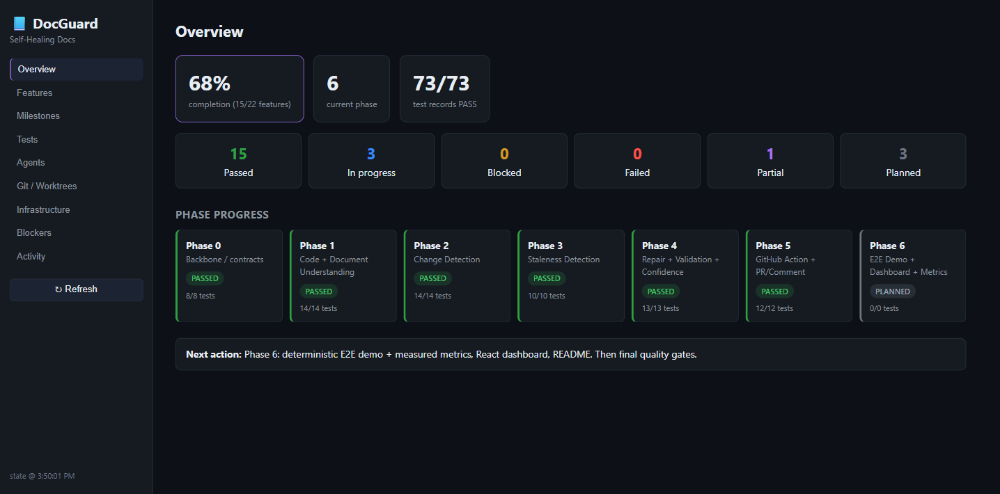
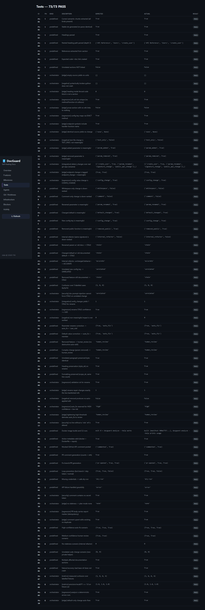

# DocGuard — Self-Healing Technical Documentation

> Detects when code changes make your Markdown docs **stale**, verifies the
> staleness, generates a **targeted** correction, validates it, and — depending
> on confidence — opens a docs-fix **PR** or leaves a **review comment**.
> Runs fully offline with deterministic mock providers; plug in OpenAI/Anthropic
> for real LLM analysis.



---

## The problem

Docs rot silently. A parameter gets renamed, a default changes, a feature is
removed — and the docs keep describing the old behaviour until a user hits it.
DocGuard watches the diff and closes that gap automatically, **changing only the
stale sentences** and never rewriting whole files.

## Pipeline

```
Code change (git diff)
  → semantic code units (Python AST)        # what actually changed
  → meaningful-change classification        # ignore whitespace/comments/refactors
  → code→doc mapping (exact + lexical + embedding)
  → LLM staleness verification (structured verdict)
  → targeted repair (only stale spans)
  → second-pass validation
  → confidence policy → auto-fix | human review | report
  → GitHub PR (high) or PR comment (low)
  → audit trail + dashboard
```

See [`docs/ARCHITECTURE.md`](docs/ARCHITECTURE.md) for the module breakdown and
[`docs/DECISIONS.md`](docs/DECISIONS.md) for design trade-offs.

## Features

- **Python semantic parser** — functions, classes, methods, config constants,
  argparse CLI commands, decorator endpoints; stable ids that survive line moves.
- **Markdown parser** — nested heading paths, section bodies, referenced symbols.
- **Change classifier** — down-ranks whitespace / comment / formatting / test /
  internal-refactor; prioritizes signature / param / default / config / CLI /
  endpoint / removal.
- **Code→doc mapping** — exact symbol refs + lexical overlap + embedding
  similarity, with a persistent cache; unrelated sections are not falsely linked.
- **Staleness verification** — minimal-context structured verdicts; grounding
  guardrail; repository text is delimited as untrusted (prompt-injection safe).
- **Targeted repair + validation** — surgical span-local edits (unaffected text
  stays byte-identical), then a factual/scope/style second pass.
- **Confidence policy** — HIGH → auto-fix PR, MEDIUM → review comment, LOW →
  report only. Configurable thresholds. Removals are never auto-edited.
- **GitHub Action** — Docker action, loop prevention, least-privilege perms,
  graceful API errors, safe dry-run without credentials. Never auto-merges.
- **Provider abstraction** — deterministic **mock** LLM + embeddings (default,
  offline) or **OpenAI / Anthropic** behind the same interface.
- **Dashboard** — React + Vite over the persistent `.orchestrator/` state.

## Installation

```powershell
# Windows PowerShell (repo uses a local venv at .venv)
python -m venv .venv
.\.venv\Scripts\python.exe -m pip install -e ".[dev]"
```
```bash
# POSIX
python -m venv .venv && . .venv/bin/activate
pip install -e ".[dev]"
```

Optional extras: `.[openai]`, `.[anthropic]`, `.[github]`, `.[vector]`.

## Configuration

All config is env / `.env` (see [`.env.example`](.env.example)). **Everything
defaults to offline mocks — no keys required.**

| Variable | Default | Purpose |
|---|---|---|
| `DOCGUARD_LLM_PROVIDER` | `mock` | `mock` \| `openai` \| `anthropic` |
| `DOCGUARD_EMBEDDING_PROVIDER` | `mock` | `mock` \| `openai` |
| `DOCGUARD_SIMILARITY_THRESHOLD` | `0.35` | mapping cut-off |
| `DOCGUARD_HIGH_CONFIDENCE` | `0.85` | auto-fix threshold |
| `DOCGUARD_MEDIUM_CONFIDENCE` | `0.5` | review threshold |
| `OPENAI_API_KEY` / `ANTHROPIC_API_KEY` / `GITHUB_TOKEN` | — | only for real providers / PRs |

## Local usage

```powershell
# Analyze a diff and print the stale-doc report (JSON)
.\.venv\Scripts\python.exe -m docguard analyze --base HEAD~1 --head HEAD

# Deterministic offline end-to-end demo (builds a throwaway repo, prints metrics)
.\.venv\Scripts\python.exe -m docguard demo
```

## GitHub Action usage

```yaml
# .github/workflows/docguard.yml
on:
  pull_request:
    paths: ["src/**", "docs/**"]
permissions:
  contents: write        # open a docs-fix branch/PR
  pull-requests: write   # comment on the PR
jobs:
  docguard:
    runs-on: ubuntu-latest
    steps:
      - uses: actions/checkout@v4
        with: { fetch-depth: 0 }
      - uses: your-org/docguard@v1
        with:
          llm-provider: mock     # set openai/anthropic + add the secret to enable
          auto-fix: "true"
        env:
          GITHUB_TOKEN: ${{ secrets.GITHUB_TOKEN }}
```

The action posts a summary comment:

> **📘 DocGuard Results** — Sections verified accurate: X · stale: Y ·
> auto-fixes: Z · requiring human review: N

High-confidence corrections open a `docguard/fix-*` PR; loop prevention skips
DocGuard's own branches and any commit tagged `[docguard skip]`.

## Dashboard

```bash
cd dashboard
npm install
npm run dev      # collects .orchestrator/*.json → serves the dashboard
```

Nine views (Overview, Features, Milestones, Tests, Agents, Git/Worktrees,
Infrastructure, Blockers, Activity) render the **real** persistent state — it is
a viewer, not the source of truth.



## Testing

```powershell
.\.venv\Scripts\python.exe -m pytest        # full suite
.\.venv\Scripts\python.exe scripts\run_milestone.py 3   # serial milestone evidence for a phase
```

Three levels: feature tests, predefined milestone scenarios (from the spec), and
**orchestrator-added** positive/negative/edge/security cases per phase. Every
milestone scenario is recorded to `.orchestrator/tests.json` with
`input / expected / actual / PASS|FAIL`. All tests run offline (mock providers).

## Measured metrics

From the deterministic demo's **7 labelled fixtures** (`docguard demo`), using
the mock oracle:

| TP | FP | FN | TN | Precision | Recall | F1 |
|----|----|----|----|-----------|--------|----|
| 3 | 0 | 0 | 4 | 1.00 | 1.00 | 1.00 |

These are computed from executed fixtures, not asserted. They measure the
pipeline + rule-based oracle on a controlled set (rename / default / removal vs
whitespace / comment / refactor / unrelated); a real LLM would be scored the same
way on a larger corpus.

## Limitations

- Python source only (the parser interface is built to add TS/Java/tree-sitter later).
- Repairs are conservative surgical swaps: parameter renames are applied only to
  backticked references, and removals are routed to human review rather than
  auto-deleting prose. Docs that reference a symbol without backticks may be
  detected as stale but produce no auto-fix (safely downgraded to review).
- The default mock LLM is a deterministic rule-based oracle, not a model — great
  for offline/CI, and the reference behaviour a real provider should match.
- Metrics are on a controlled fixture set, not a claim about arbitrary repos.

## Future improvements

- Additional language parsers via tree-sitter.
- Model-backed repair for prose-level rewrites (behind the existing interface).
- Broader mapping signals (call graphs, cross-file references).
- Real-corpus metric harness.

## External requirements (optional)

| Blocker | Needed for | Provide |
|---|---|---|
| `OPENAI_API_KEY` / `ANTHROPIC_API_KEY` | real LLM/embeddings (mock works without) | set the key + `DOCGUARD_LLM_PROVIDER` |
| `GITHUB_TOKEN` | real PR/comment (mocked API is tested) | provide token or run in Actions |

See [`.orchestrator/blockers.json`](.orchestrator/blockers.json) and
[`CLAUDE.md`](CLAUDE.md) (resume protocol).
