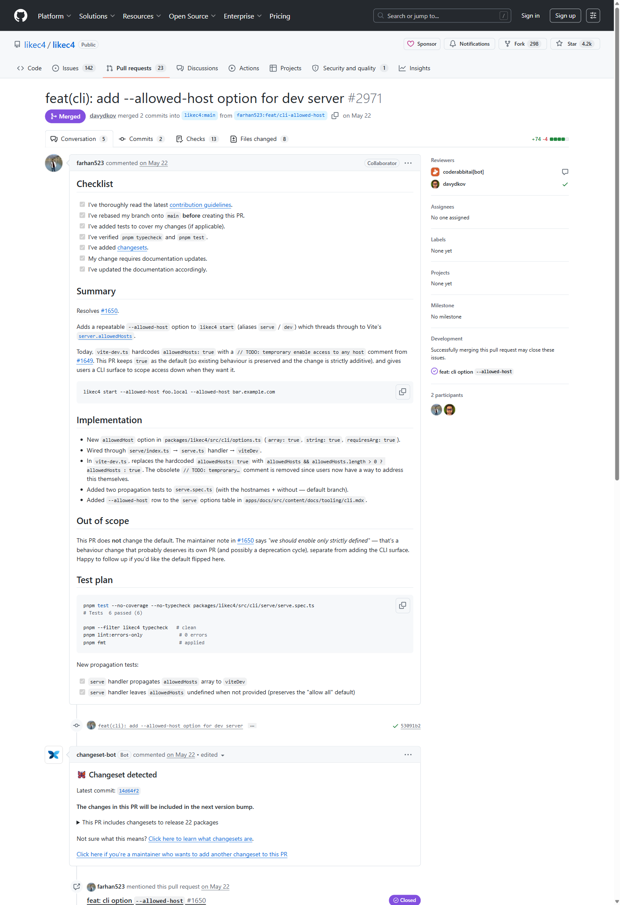
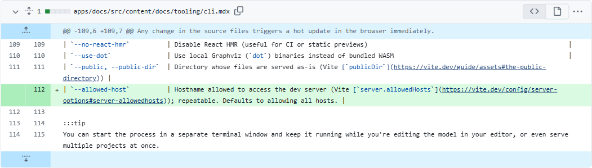

<div align="center">

# 📘 DocGuard — Self-Healing Technical Documentation

**Docs rot silently. DocGuard catches it in the pull request that caused it — and fixes it.**

It detects when a code change makes your Markdown docs stale, verifies the staleness with an LLM,
generates a **targeted** correction, validates it, and — depending on confidence — opens a docs-fix
**PR** or leaves a **review comment**.

[](https://www.python.org/)
[](#-testing)
[](#)
[](#)
[](#-configuration)
[](LICENSE)

</div>

---

## 🕳️ The gap DocGuard closes — a real example

In **FastAPI**, the validation parameter `regex` was deprecated in favour of `pattern`:

> **PR #9786 — "Deprecate parameter `regex`, use `pattern` instead"** *(Jul 2023)*


The code changed. The docs kept saying `regex`. They stayed stale until a *different* contributor
noticed and manually opened a **separate** PR — **~2 months later**:

> **PR #10085 — "Fix validation parameter name in docs, from `regex` to `pattern`"** *(Sep 2023)*


**That two-month gap is the problem.** DocGuard would have flagged the stale `regex` mention the
moment #9786 landed, generated the `regex` → `pattern` correction, validated it, and attached it to
the same PR — **changing only the stale sentence and nothing else.**

The same pattern shows up everywhere. Here a new CLI flag lands in `likec4` and the docs table has
to grow a row by hand — exactly the kind of surgical, one-line doc edit DocGuard produces:

<div align="center">





</div>

---

## 🔄 How it works

```
Code change (git diff)
  → semantic code units (Python AST · TS/JS/Java tree-sitter)   # what actually changed
  → meaningful-change classification                            # ignore whitespace/comments/refactors
  → code→doc mapping (exact + lexical + embedding)              # which sections document it
  → LLM staleness verification (structured verdict)             # is the doc actually wrong?
  → targeted repair (only the stale spans)                      # surgical edit, rest byte-identical
  → second-pass validation                                      # independently confirm the fix
  → confidence policy → auto-fix | human review | report
  → GitHub PR (high) or PR comment (low)
  → audit trail + dashboard
```

The whole thing is **cost-controlled**: unrelated sections are filtered out *before* any LLM call,
only meaningful changes are verified, and every embedding is cached by content hash. Repository
content is always delimited as **untrusted data** in prompts (prompt-injection safe), and DocGuard
**never auto-merges** and **never auto-deletes prose** — removals always go to human review.

See [`docs/ARCHITECTURE.md`](docs/ARCHITECTURE.md) for the module breakdown and
[`docs/DECISIONS.md`](docs/DECISIONS.md) for design trade-offs.

---

## ✨ Features

- **Multi-language semantic parsing** — Python via the stdlib `ast`; **TypeScript / JavaScript /
  Java** via tree-sitter (prebuilt wheels, no compiler). One language-agnostic core; a new language
  is a sibling parser + one dispatch row.
- **Meaningful-change classifier** — down-ranks whitespace / comment / formatting / test /
  internal-refactor; prioritizes signature / param / default / config / CLI / endpoint / removal.
  Two versions with the same AST are proven equivalent and never reach the LLM.
- **Code→doc mapping** — exact symbol refs + lexical overlap + embedding similarity, with a
  persistent cache and a *"documents vs merely mentions"* guard so tutorials aren't falsely linked.
- **Staleness verification** — minimal-context structured verdicts; an ungrounded "it's stale"
  claim is confidence-capped so it can never trigger an automated edit.
- **Surgical repair + independent validation** — span-local edits (unaffected text stays
  byte-identical), then a separate validator confirms the edit is scoped, style-preserving, and
  actually removed the stale claim.
- **Confidence policy** — HIGH → auto-fix PR, MEDIUM → review comment, LOW → report only.
  Configurable thresholds. Removals are never auto-edited.
- **GitHub Action** — Docker action, loop prevention, least-privilege perms, graceful API errors,
  safe dry-run with no credentials. Never auto-merges.
- **Provider abstraction** — deterministic **mock** LLM + embeddings (default, fully offline) or
  **OpenAI / Anthropic / any OpenAI-compatible endpoint** behind the same interface.
- **Dashboard** — React + Vite over the persistent `.orchestrator/` build/run state.

---

## 🚀 Quick start

```powershell
# Windows PowerShell (repo uses a local venv at .venv)
python -m venv .venv
.\.venv\Scripts\python.exe -m pip install -e ".[dev]"
```
```bash
# POSIX
python -m venv .venv && . .venv/bin/activate
pip install -e ".[dev]"
```

```bash
# Deterministic, fully-offline end-to-end demo (builds a throwaway repo, prints real metrics)
python -m docguard demo

# Analyze a diff and print the stale-doc report (JSON)
python -m docguard analyze --base HEAD~1 --head HEAD
```

**No API key required** — everything defaults to offline mock providers. Optional extras:
`.[openai]`, `.[anthropic]`, `.[github]`, `.[vector]`.

---

## ⚙️ Configuration

All config is env / `.env` (see [`.env.example`](.env.example)). **Everything defaults to offline
mocks — no keys needed.**

| Variable | Default | Purpose |
|---|---|---|
| `DOCGUARD_LLM_PROVIDER` | `mock` | `mock` \| `openai` \| `anthropic` |
| `DOCGUARD_EMBEDDING_PROVIDER` | `mock` | `mock` \| `openai` |
| `DOCGUARD_OPENAI_BASE_URL` | — | optional OpenAI-compatible endpoint (NVIDIA / vLLM / …) |
| `DOCGUARD_SIMILARITY_THRESHOLD` | `0.35` | mapping cut-off |
| `DOCGUARD_HIGH_CONFIDENCE` | `0.85` | auto-fix threshold |
| `DOCGUARD_MEDIUM_CONFIDENCE` | `0.5` | review threshold |
| `OPENAI_API_KEY` / `ANTHROPIC_API_KEY` / `GITHUB_TOKEN` | — | only for real providers / PRs |

---

## 🤖 GitHub Action

```yaml
# .github/workflows/docguard.yml
on:
  pull_request:
    paths: ["src/**", "docs/**"]
permissions:
  contents: write        # open a docs-fix branch/PR
  pull-requests: write   # comment on the PR
jobs:
  docguard:
    runs-on: ubuntu-latest
    steps:
      - uses: actions/checkout@v4
        with: { fetch-depth: 0 }
      - uses: NeetigyaShah/docguard@v1
        with:
          llm-provider: mock     # set openai/anthropic + add the secret to enable
          auto-fix: "true"
        env:
          GITHUB_TOKEN: ${{ secrets.GITHUB_TOKEN }}
```

The action posts a summary comment:

> **📘 DocGuard Results** — Sections verified accurate: X · stale: Y · auto-fixes: Z · requiring human review: N

High-confidence corrections open a `docguard/fix-*` PR; loop prevention skips DocGuard's own branches
and any commit tagged `[docguard skip]`.

---

## 📊 Dashboard

```bash
cd dashboard
npm install
npm run dev      # collects .orchestrator/*.json → serves the dashboard
```

Nine views (Overview, Features, Milestones, Tests, Agents, Git/Worktrees, Infrastructure, Blockers,
Activity) render the **real** persistent state — it is a viewer, not the source of truth.


---

## 🧪 Testing

```powershell
.\.venv\Scripts\python.exe -m pytest                       # full suite (106 tests, offline)
.\.venv\Scripts\python.exe scripts\run_milestone.py 3      # serial milestone evidence for a phase
```

Three levels: feature tests, predefined milestone scenarios (from the spec), and orchestrator-added
positive/negative/edge/security cases per phase. Every milestone scenario is recorded to
`.orchestrator/tests.json` with `input / expected / actual / PASS|FAIL`. All tests run offline.

---

## 📈 Measured metrics

From the deterministic demo's **7 labelled fixtures** (`docguard demo`), using the mock oracle:

| TP | FP | FN | TN | Precision | Recall | F1 |
|----|----|----|----|-----------|--------|----|
| 3 | 0 | 0 | 4 | 1.00 | 1.00 | 1.00 |

These are **computed from executed fixtures, not asserted.** They measure the pipeline + rule-based
oracle on a *controlled* set (rename / default / removal vs whitespace / comment / refactor /
unrelated). **They are not a claim about arbitrary real repos** — see below.

---

## 🔬 Real-world evaluation (honest)

Run against real clones of **Pydantic** and **FastAPI** (real code, real Markdown, real git diffs)
via `scripts/eval_realrepo.py` and `scripts/real_case_demo.py`:

- **No false positives.** Negative controls (comment-only edits) were flagged stale **0 times** by
  both providers on both repos. It won't spam bad PRs.
- **Hand-verified real case** — Pydantic `Field(frozen=…)`, parameter renamed `frozen → is_frozen`:
  - **mock**: ✅ flags stale (0.92) **and** emits a correct surgical fix (`` `frozen` `` →
    `` `is_frozen` ``, rest byte-identical).
  - **real LLM** (DeepSeek via an OpenAI-compatible endpoint): ✅ flags stale (1.0) with correct
    reasoning; the **repair step returned no change** on a long prose section — detection is solid,
    the LLM *repair* path needs hardening.
- **Mock recall on real repos is low** by design — the deterministic mock only matches structural
  tokens, so it's a **high-precision structural baseline, not a semantic detector**. A real LLM is
  required for semantic cases.
- **The free LLM endpoint used was slow** (~30–70 s/call), so large CI runs need a faster provider.

Reproduce: `python scripts/real_case_demo.py` (set `DOCGUARD_LLM_PROVIDER=openai` + key for the
real-LLM column). Evidence lives in [`docs/eval/`](docs/eval).

---

## ⚠️ Limitations

- Repairs are conservative surgical swaps: parameter renames apply only to backticked references, and
  removals route to human review rather than auto-deleting prose. Docs that reference a symbol without
  backticks may be detected as stale but produce no auto-fix (safely downgraded to review).
- The default mock LLM is a deterministic rule-based oracle, not a model — great for offline/CI, and
  the reference behaviour a real provider should match.
- Metrics are on a controlled fixture set, not a claim about arbitrary repos.

## 🧭 Roadmap

- Model-backed repair for prose-level rewrites (behind the existing interface).
- Broader mapping signals (call graphs, cross-file references).
- A real-corpus metric harness with curated labels.
- More language parsers via tree-sitter.

---

<div align="center">
<sub>Built by <a href="https://github.com/NeetigyaShah">Neetigya Shah</a> · MIT licensed · runs fully offline, no API key required.</sub>
</div>
